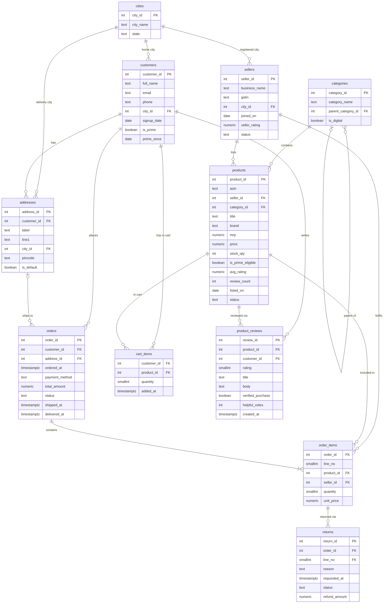

# ER Diagram — Amazon Online Shopping Database

```mermaid
erDiagram
    cities {
        int city_id PK
        text city_name
        text state
    }

    categories {
        int category_id PK
        text category_name
        int parent_category_id FK
        boolean is_digital
    }

    sellers {
        int seller_id PK
        text business_name
        text gstin
        int city_id FK
        date joined_on
        numeric seller_rating
        text status
    }

    customers {
        int customer_id PK
        text full_name
        text email
        text phone
        int city_id FK
        date signup_date
        boolean is_prime
        date prime_since
    }

    addresses {
        int address_id PK
        int customer_id FK
        text label
        text line1
        int city_id FK
        text pincode
        boolean is_default
    }

    products {
        int product_id PK
        text asin
        int seller_id FK
        int category_id FK
        text title
        text brand
        numeric mrp
        numeric price
        int stock_qty
        boolean is_prime_eligible
        numeric avg_rating
        int review_count
        date listed_on
        text status
    }

    orders {
        int order_id PK
        int customer_id FK
        int address_id FK
        timestamptz ordered_at
        text payment_method
        numeric total_amount
        text status
        timestamptz shipped_at
        timestamptz delivered_at
    }

    order_items {
        int order_id FK
        smallint line_no
        int product_id FK
        int seller_id FK
        smallint quantity
        numeric unit_price
    }

    cart_items {
        int customer_id FK
        int product_id FK
        smallint quantity
        timestamptz added_at
    }

    product_reviews {
        int review_id PK
        int product_id FK
        int customer_id FK
        smallint rating
        text title
        text body
        boolean verified_purchase
        int helpful_votes
        timestamptz created_at
    }

    returns {
        int return_id PK
        int order_id FK
        smallint line_no FK
        text reason
        timestamptz requested_at
        text status
        numeric refund_amount
    }

    %% Relationships

    cities         ||--o{ customers        : "home city"
    cities         ||--o{ sellers          : "registered city"
    cities         ||--o{ addresses        : "delivery city"

    customers      ||--o{ addresses        : "has"
    customers      ||--o{ orders           : "places"
    customers      ||--o{ cart_items       : "has in cart"
    customers      ||--o{ product_reviews  : "writes"

    categories     ||--o{ products         : "contains"
    categories     }o--o| categories       : "parent of"

    sellers        ||--o{ products         : "lists"
    sellers        ||--o{ order_items      : "fulfils"

    addresses      |o--o{ orders           : "ships to"

    products       ||--o{ order_items      : "included in"
    products       ||--o{ cart_items       : "in cart"
    products       ||--o{ product_reviews  : "reviewed via"

    orders         ||--|{ order_items      : "contains"

    order_items    ||--o{ returns          : "returned via"
```
